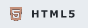
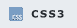
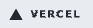

# 🐶 Hyeonseok's Portfolio

  <a href="https://hyeonseok93-portfolio.vercel.app/" style="text-decoration:none;"><picture><source media="(prefers-color-scheme: dark)" srcset="assets/readme_badges/dark/vercel.png" /></picture></a> 
  <a href="https://hyeonseok93-portfolio.vercel.app/">https://hyeonseok93-portfolio.vercel.app/</a>

  <picture></picture>

  김현석(Hyeonseok Kim)의 개인 포트폴리오 사이트입니다.

  <strong>✨ 들어오셔서 확인해보세요!!! ✨</strong>

 

## 🛠 Built With

  <picture>
    <source media="(prefers-color-scheme: dark)" srcset="assets/badges/dark/html5.png" />
    
  </picture>
  <picture>
    <source media="(prefers-color-scheme: dark)" srcset="assets/badges/dark/css3.png" />
    
  </picture>
  <picture>
    <source media="(prefers-color-scheme: dark)" srcset="assets/badges/dark/javascript.png" />
    
  </picture>
  <picture>
    <source media="(prefers-color-scheme: dark)" srcset="assets/badges/dark/webcomponents.png" />
    
  </picture>
  <picture>
    <source media="(prefers-color-scheme: dark)" srcset="assets/badges/dark/vercel.png" />
    
  </picture>

 
