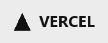

# 🐶 Hyeonseok's Portfolio

<p align="center">
  <a href="https://hyeonseok93-portfolio.vercel.app/" style="text-decoration:none;"><picture><source media="(prefers-color-scheme: dark)" srcset="assets/readme_badges/dark/vercel.png" /></picture></a><br />
  <a href="https://hyeonseok93-portfolio.vercel.app/">https://hyeonseok93-portfolio.vercel.app/</a>
</p>

<p align="center">
  <picture></picture>
</p>

<p align="center">
  김현석(Hyeonseok Kim)의 개인 포트폴리오 사이트입니다.
</p>

<p align="center">
  <strong>✨ 들어오셔서 확인해보세요!!! ✨</strong>
</p>

<br />

## 🛠 Built With

<p align="center">
  
  
  
  
  
</p>

<br />

## 📂 Structure

```text
Hyeonseok93.portfolio/
├── index.html          # Cover
├── profile.html        # Profile · Journey
├── works.html          # Papers · Mini · Final
├── css/
│   ├── site.css        # 공통 토큰 · 네비 · 뱃지 · 셀프호스팅 폰트
│   └── works.css       # Works 페이지 전용
├── js/
│   └── components.js   # <site-nav> · <site-footer> · <tech-badge>
└── assets/
    ├── favicon.png
    ├── confidently.gif
    ├── profile.png
    ├── fonts/          # Figtree · Outfit (로컬)
    ├── stacks/         # 기술 스택 아이콘
    └── readme_badges/  # README 플랫폼 뱃지 (dark/light)
```

<br />

## 📄 Pages

| 페이지 | 파일 | 내용 |
| :--- | :--- | :--- |
| Cover | `index.html` | 이름 · 한 줄 소개 · Profile / Works / GitHub |
| Profile | `profile.html` | 학력 · 경력 · 교육 · Journey 타임라인 |
| Works | `works.html` | Papers · Mini Projects · Final Project |

<br />

## 💻 Local Preview

빌드 없이 정적 HTML입니다. 로컬에서 파일을 열거나 간단한 서버로 보면 됩니다.

```bash
# 예: Python
python -m http.server 5500
```

브라우저에서 `http://localhost:5500` 접속

<br />

## 🚀 Deploy

- **Host:** Vercel (Hobby)
- **Source:** GitHub `main` 자동 배포
- **Framework:** Other (빌드 없음)
- **Live:** [hyeonseok93-portfolio.vercel.app](https://hyeonseok93-portfolio.vercel.app/)

push만 하면 반영됩니다.

<br />

## ✍️ Notes

- 공통 네비 / 푸터 / 스택 뱃지는 `js/components.js` + `css/site.css`에서 관리합니다.
- 폰트는 Google Fonts가 아니라 `assets/fonts`에 셀프호스팅합니다.
- Works의 Papers · Final은 각각 한 상세 페이지로 연결되도록 페어 호버가 걸려 있습니다.

<br />

<p align="center">
  <sub>Hyeonseok Kim · Portfolio</sub>
</p>